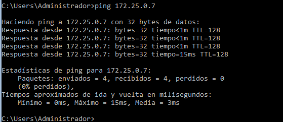

# PR0404: Administración remota del servidor

## 1.- Entorno virtualizado

- **Windows Server 2019 con experiencia de escritorio** (debes utilizar el que ya tienes preparado del otro día)
- **Windows Server 2016 en modo Core**, este equipo tendrá dos adaptadores de red, uno en modo NAT y otro en modo solo-anfitrión
- **Windows Server 2019 en modo Core**, este equipo tendrá dos adaptadores de red, uno en modo NAT y otro en modo solo-anfitrión

Vamos a aprovechar la misma red que preparamos el otro día (`172.25.0.0/16`) para añadir el nuevo equipo a la misma a través de su adaptador en modo solo-anfitrión.

## 2. Preparación de las máquinas

- **Añade el nuevo equipo a la red**, *comprueba que tiene visibilidad* con los tres equipos que ya tienes en ella (las dos máquinas virtuales y el equipo anfitrión)
    - Ping desde CAG-CORE2016 a CAG-CORE2019
        
    - Ping desde CAG-CORE2016 a CAG-2019
        
    - Ping desde CAG-CORE2019 a CAG-2019
        

- Asigna **nombres a los equipo**, estos nombres serán:
  - Windows Server 2019 con entorno gráfico: `{INICIALES}-2019`
        
  - Windows Server 2019 en modo core: `{INICIALES}-CORE-2019`
        
  - Windows Server 2016 en modo core: `{INICIALES}-CORE-2016`
        

## 3. Configuración del acceso remoto al nuevo equipo

- Realiza los pasos necesarios para poder utilizar **PowershellDirect** sobre el nuevo equipo desde el servidor principal (el que tiene entorno gráfico)
    - En CAG-CORE-2016 y en CAG-CORE-2019: utilizamos el comando `Enable-PSRemoting -Force` en Powershell
        
    - En CAG-2019 añadimos el CAG-CORE-2016 a la lista de TrustedHosts con el comando `Set-Item     WSMan:\localhost\Client\TrustedHosts -Value "172.25.0.6"`
        
    - En CAG-2019 añadimos el CAG-CORE-2019 a la lista de TrustedHosts con el comando `Set-Item     WSMan:\localhost\Client\TrustedHosts -Value "172.25.0.7"`
        

- Asegúrate de que sigas pudiendo administrar el otro equipo en modo Core
- Para comprobarlo, crea de forma remota en ambos equipo en modo Core un usuario con privilegios de administrador llamado `{iniciales}`. Si no sabes cómo hacerlo tienes una breve guía [aquí](https://intelaf.wordpress.com/2022/08/12/como-crear-usuario-administrador-desde-powershell-en-windows-11/)
    1. Desde CAG-2019 a CAG-CORE-2016:
       - Utilizamos el comando `Set-Item WSMan:\localhost\Client\TrustedHosts -Value "172.25.0.6"`
           
       - Asignamos una contraseña con el comando `$Password = Read-Host -AsSecureString`
       - Creamos el usuario con el comando `New-LocalUser "CAG" -Password $Password -FullName "Carla Alvarez"`
           
    2. Desde CAG-2019 a CAG-CORE-2019:
       - Utilizamos el comando `Set-Item WSMan:\localhost\Client\TrustedHosts -Value "172.25.0.6"`
           
       - Asignamos una contraseña con el comando `$Password = Read-Host -AsSecureString`
       - Creamos el usuario con el comando `New-LocalUser "CAG" -Password $Password -FullName "Carla Alvarez"`
           
    

## 4. Configuración del acceso remoto sobre HTTPS

- Una vez que hayas comprobado que tienes todo bien configurado es el momento de asegurar nuestra red preparándola para que utilice **WinRM sobre HTTPS** utilizando un certificado autofirmado.
- Realiza los pasos necesarios para que la comunicación con ambos servidores utilice este mecanismo.
    1. Crear un certificado autofirmado
        Desde CAG-CORE-2016, ejecuto el comando `New-SelfSignedCertificate -DnsName "172.25.0.6" -CertStoreLocation Cert:\LocalMachine\My -KeyLength 2048`
            
    2. Configurar el Listener de WimRM para HTTPS
        Desde CAG-2019, ejecuto el comando para eliminar el listener `Remove-Item -Path WSMan:\localhost\Listener\Listener* -Recurse`
        Buscamos el hash del certificado con el comando 
        
        Creamos un nuevo listener con el comando
        Nos aseguramos de que el puerto 5986 ester abierto en el firewall
    3. Verifificar la configuración
    4. Configurar el cliente para usar HTTPS

