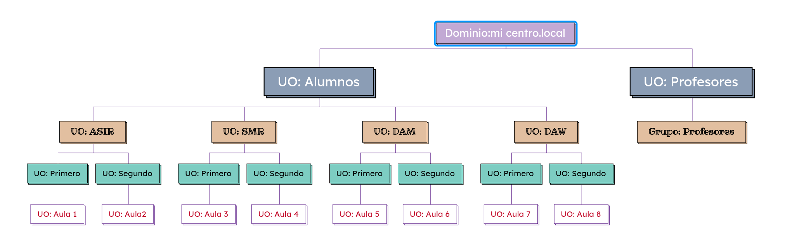

# Proyecto de la 2ª Evaluación

## Estructura del dominio

La estructura de dominio segirá el siguiente esquema:
 


Dominio Principal: micentro.local

    - UO: Alumnos: 

        - UO: ASIR:

            - UO: Primero (30 alumnos)

                - UO: Aula1 (15 equipos)

            - UO: Segundo (15 alumnos)

                - UO: Aula2 (15 equipos)

        - UO: SMR:

            - UO: Primero (30 alumnos)

                - UO: Aula3 (15 equipos)

            - UO: Segundo (15 alumnos)

                - UO: Aula4 (15 equipos)

        - UO: DAM:

            - UO: Primero (30 alumnos)

                - UO: Aula5 (15 equipos)

            - UO: Segundo (15 alumnos)

                - UO: Aula6 (15 equipos)

        - UO: DAW:

            - UO: Primero (30 alumnos)

                - UO: Aula7 (15 equipos)

            - UO: Segundo (15 alumnos)

                - UO: Aula8 (15 equipos)

    - UO: Profesores:

        - Grupo: Profesores


### Justificación de la Estructura

    1. Separación de Alumnos y Profesores:

        - Descripción: La creación de UOs separadas para alumnos y profesores permite una gestión clara y eficiente de los diferentes grupos de usuarios.
        - Beneficios:
            -Políticas de Seguridad Específicas: Se pueden aplicar políticas de seguridad adaptadas a las necesidades de cada grupo. Por ejemplo, los profesores pueden tener acceso a recursos y herramientas que no son necesarios para los alumnos, lo que mejora la seguridad general del sistema.
            - Gestión de Permisos: Facilita la asignación y revocación de permisos de acceso a recursos, asegurando que cada grupo tenga acceso solo a lo que necesita.

    2. Organización por Ciclos Formativos:

        -Descripción: La estructura organiza a los alumnos en UOs según su ciclo formativo (ASIR, SMR, DAM, DAW) y sus respectivos cursos (Primero y Segundo).
        - Beneficios:
            - Administración de Recursos: Permite gestionar recursos como aulas, equipos y materiales de manera más eficiente, asegurando que cada grupo tenga lo que necesita para su formación.
            - Aplicación de Políticas Específicas: Facilita la implementación de políticas y procedimientos específicos para cada ciclo, como horarios, evaluaciones y actividades extracurriculares.

    3. Aulas como UOs:

        - Descripción: Cada curso tiene su propia aula, representada como una UO, lo que permite gestionar los recursos y equipos de forma independiente.
        - Beneficios:
            - Gestión Independiente de Recursos: Cada aula puede tener su propio conjunto de equipos y recursos, lo que permite un control más preciso sobre el uso y mantenimiento de los mismos.
            - Flexibilidad en la Asignación de Clases: Facilita la asignación de clases y recursos a diferentes grupos de alumnos, optimizando el uso del espacio y los equipos disponibles.

    4. Grupo de Profesores:

        - Descripción: La UO de Profesores agrupa a todos los docentes que imparten clases en los diferentes ciclos formativos.
        - Beneficios:
            - Centralización de la Gestión: Permite gestionar a todos los docentes de manera centralizada, facilitando la asignación de permisos y recursos.
            - Facilitación de la Comunicación: Mejora la comunicación y colaboración entre los profesores, permitiendo una mejor coordinación en la planificación de clases y actividades.

#### Conclusión

La estructura organizativa propuesta no solo mejora la gestión de usuarios y recursos, sino que también permite una mayor flexibilidad y seguridad en el entorno educativo. Al separar a los alumnos y profesores, agrupar a los estudiantes por ciclos formativos y gestionar las aulas como UOs independientes, se crea un sistema más eficiente y adaptado a las necesidades de la institución educativa. Esta organización facilita la implementación de políticas específicas, optimiza el uso de recursos y mejora la experiencia educativa tanto para alumnos como para profesores.

## Automatización 
### Script de alta de alumnos y de carpetas personales
```bash
# Importar el módulo de Active Directory
Import-Module ActiveDirectory

# Ruta del archivo CSV
$csvPath = "C:\alumnos.csv"

# Importar los datos del archivo CSV
$alumnos = Import-Csv -Path $csvPath -Delimiter ","

# Dominio
$dom = "micentro.local"

# Iterar sobre cada alumno en el archivo CSV
foreach ($alumno in $alumnos) {
    try {
        # Crear el nombre de usuario
        $nomUsu = $alumno.Nombre
        $recorte = $nomUsu.Substring(0, [Math]::Min($nomUsu.Length, 1))
        $username = "$($recorte)$($alumno.'Primer Apellido')"

        # Generar el UPN
        $upn = "$username@$dom"

        # Verificar unicidad del UPN
        $count = 1
        while (Get-ADUser  -Filter {UserPrincipalName -eq $upn}) {
            $username = "$username$counter"  # Agregar un número si ya existe
            $upn = "$username@$dom"  # Actualizar el UPN
            $count = $count+1
        }

        # Contraseña
        $pswd = ConvertTo-SecureString -String "Passw0rd!" -AsPlainText -Force

        # Ciclo y curso
        $ciclo = $alumno.Ciclo
        $curso = $alumno.Curso

        # Crear el usuario en Active Directory
        New-ADUser -GivenName "$($alumno.Nombre)" `
                    -Name "$($alumno.Nombre) $($alumno.'Primer Apellido') $($alumno.'Segundo Apellido')" `
                    -SamAccountName $username `
                    -Surname "$($alumno.'Primer Apellido') $($alumno.'Segundo Apellido')" `
                    -UserPrincipalName "$($username)@$($dom)" `
                    -Path "OU=$curso,OU=$ciclo,OU=Alumnos,DC=micentro,DC=local" `
                    -HomeDirectory "\\MICENTRO\instituto\$username"  `
                    -HomeDrive 'H:' `
                    -AccountPassword $pswd `
                    -Enabled $true `

        # Crear carpeta local para el usuario
        New-Item -Path "C:\Shares\instituto" -Name $username -ItemType Directory -ErrorAction SilentlyContinue

        # Permitir acceso a la carpeta del usuario
        $user = $username
        $acl = Get-Acl "C:\Shares\instituto\$user"
        $acl.SetAccessRuleProtection($true, $false)
        $ar = New-Object System.Security.AccessControl.FileSystemAccessRule("$user", "FullControl", "ContainerInherit,ObjectInherit", "None", "Allow")
        $acl.SetAccessRule($ar)

        # Asignar la ACL a la carpeta del usuario
        Set-Acl "C:\Shares\instituto\$user" $acl

        # Meter usuario en cada grupo
        Add-ADGroupMember -Identity $curso -Members $username
    } catch {
        Write-Host "Fallo al crear usuario $($alumno.Nombre) - $_"
    }

```
#### Justificación del scrip de automatización

    - Razones Técnicas: La elección de PowerShell como herramienta para la automatización se basa en su integración nativa con Active Directory y su capacidad para manejar tareas administrativas de manera eficiente. Además, PowerShell permite la manipulación de ACLs (Listas de Control de Acceso) para gestionar permisos de carpetas de forma programática.
    
    - Comparación con Alternativas: Otras alternativas, como la creación manual de usuarios y carpetas, serían mucho más propensas a errores y consumirían un tiempo considerable. La automatización no solo ahorra tiempo, sino que también reduce la posibilidad de errores, garantizando que todos los usuarios y carpetas se creen de manera consistente y conforme a las políticas establecidas.

#### Justificación de la Estructura de Carpetas

    - Carpetas Personales para Cada Alumno: Cada alumno tiene su propia carpeta personal, lo que permite un espacio privado para almacenar documentos y recursos.

    - Carpetas Compartidas por Grupo: Se crean carpetas compartidas para cada grupo, facilitando la colaboración y el intercambio de recursos entre los miembros del grupo.

    - Control de Acceso: Al establecer permisos específicos, se asegura que solo los miembros del grupo tengan acceso a su carpeta compartida, protegiendo la información de otros grupos.

## Políticas de Directivas

### Directivas de Seguridad

1. Directivas de contraseña
    - Longitud mínima de la contraseña: 8 caracteres.
    - La contraseña debe cumplir con los requisitos de complejidad: Habilitar.
    - Vigencia máxima de la contraseña: 90 días.

    - Justificación: Las políticas de contraseñas son fundamentales para proteger las cuentas de usuario. La longitud mínima y la complejidad ayudan a prevenir accesos no autorizados, mientras que la caducidad asegura que las contraseñas no se vuelvan obsoletas.

2.	Directivas de Bloqueo de Cuenta:
    - Umbral de bloqueo: Se bloquea la cuenta después de 5 intentos fallidos de inicio de sesión. 
    - Duración del bloqueo: La cuenta se desbloquea automáticamente después de 15 minutos

    - Justificación: Esta política es crucial para prevenir ataques de fuerza bruta. Al limitar el número de intentos fallidos, se reduce significativamente el riesgo de que un atacante pueda adivinar una contraseña.
  
3.	Restricciones de Acceso a CMD:
    - Prohibición de acceso a CMD para alumnos: 
    - Excepción para profesores: 
  
    - Justificación: La prohibición del acceso a CMD para los alumnos es una medida de seguridad importante. Los alumnos no necesitan acceso a la línea de comandos para realizar su trabajo académico, y permitirlo podría darles la capacidad de ejecutar comandos que comprometan la seguridad del sistema. La excepción para los profesores es razonable, ya que ellos pueden necesitar realizar tareas administrativas.
  
4.	Restricciones de Acceso a Internet:
    - Filtrado de contenido: Se implementa un sistema de filtrado de contenido para restringir el acceso a sitios web inapropiados o no relacionados con el aprendizaje. 
    - Excepciones para recursos educativos: Se permite el acceso a ciertos recursos educativos.
    
    - Justificación: La restricción del acceso a ciertos sitios web es esencial para mantener un entorno de aprendizaje seguro. Los alumnos deben estar protegidos de contenido inapropiado y distracciones que puedan afectar su rendimiento académico.


### GPO aplicadas a alumnos

1. No permitir cambiar fondo de pantalla

    - Ruta: Configuración de usuario > Directivas > Plantillas Administrativas > Panel de Control > Personalización > Impedir cambiar el fondo de pantalla>Habilitado

    - Justificación: Mantiene un entorno de trabajo uniforme y profesional, evitando distracciones y asegurando que el fondo sea apropiado para el contexto educativo.

2. Prohibir acceso a ajustes y panel de control

    - Ruta: Configuración de usuario > Directivas > Plantillas Administrativas > Panel de Control > Pantalla > Deshabilitar Panel de Control de pantalla>Habilitado

    - Justificación: Previene cambios no autorizados en la configuración del sistema, garantizando la estabilidad y seguridad de los equipos.

3. Recibir actualizaciones de windows

    - Ruta: Configuración de usuario > Directivas> Plantillas Administrativas > Sistema > Actualizaciones automáticas de Windows>Deshabilitado

    - Justificación: Permite controlar a los administradores cuándo y cómo se aplican las actualizaciones, evitando interrupciones en las clases y asegurando un rendimiento óptimo.

4. Deshabilitar Cambiar contaseña

    - Ruta: Configuración de usuario > Directivas> Plantillas Administrativas > Sistema>Opciones Ctrl+Alt+Del > Quitar la opción Cambiar contraseña>Habilitado

    - Justificación: Evita que los alumnos cambien sus contraseñas sin supervisión, lo que puede llevar a problemas de acceso y contraseñas débiles. Facilita un proceso de gestión de contraseñas más seguro.

5. Prohibir cmd

    - Ruta: Configuración de usuario > Directivas > Plantillas Administrativas > Sistema > Impedir el acceso al intérprete de comandos>Habilitado

    - Justificación: Protege la integridad del sistema al restringir el acceso a la línea de comandos, evitando que los alumnos ejecuten comandos que puedan comprometer la seguridad del sistema.


